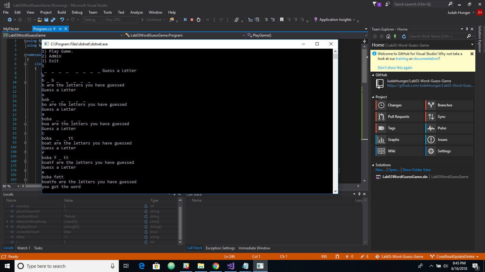

# Word Guess Game

-This app is a word guess game.
-Once the app starts it Opens up a menu to play game, admin or exit.
-It will create defualt words in a text file that the player can use, or if they want to edit they can enter admin menu.
-For the game it will keep track of letter guessed and show if you correctly guess a letter.
-In admin menu, the user can view all the words or edit what words are used. 

#Example
-player guesses - a.
-player guesses - b.

- _ _ _ _ _ _ _ _ = _ _ a _ _ a _ _
Letters guessed are a b 

--StarWars-- is the word the plaer is trying to guess.
